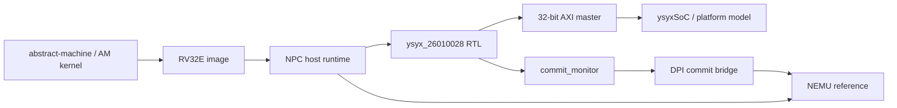
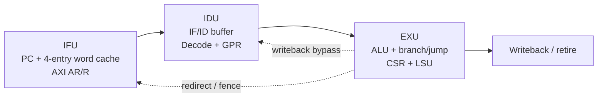

# ysyx_26010028 工程

这是 `ysyx_26010028` 的一生一芯工程，包含 Abstract Machine 运行时、NEMU 参考模拟器、NPC 仿真器以及 ysyxSoC 的适配补丁。工程的重点是一个保持真实三级流水线结构的 RV32E NPC，并通过 AXI 主接口连接片上 SoC 模型。

## 项目组织

```text
ysyx-test/
├── abstract-machine/       AM 运行时、启动代码、设备抽象和链接脚本
├── nemu/                   RV32 参考模拟器和 DiffTest 参考端
├── npc/                    NPC 主机软件、RTL、DPI 和仿真脚本
├── patch/
│   ├── rt-thread-am/       RT-Thread AM 适配补丁
│   └── ysyxSoC/            ysyxSoC 集成补丁
├── Makefile                tracer-ysyx 自动提交入口
└── README.md               工程说明
```

`ysyxSoC` 源码不作为本提交仓库的普通目录保存，而是通过 `patch/ysyxSoC/` 中的 format-patch 适配。该补丁基于最新 32 位 ysyxSoC，NPC 顶层 AXI 数据宽度保持 32 位；外部物理 SDRAM 的 16 位 `dq` 引脚属于器件接口，不是 AXI 数据宽度转换。

工程分支的职责如下：

- `master`：按工作区普通 `git add .` 形成的本地备份提交。
- `tracer-ysyx`：由子项目中的 `make sim` 自动记录过程提交，保留开发轨迹。
- `submission`：按提交目录整理后的单根提交分支，用于交付或推送。

## 总体架构



NPC 主机负责加载镜像、驱动仿真模型、提供内存和设备访问、维护运行状态以及调用 DiffTest。RTL 只通过顶层 AXI 主接口访问外部存储器和设备；提交监视器输出提交 PC 和指令，软件层在提交点与 NEMU 对比寄存器和内存状态。

## NPC 软件层

`npc/csrc/` 是仿真器的主机侧实现：

| 目录或文件 | 职责 |
| --- | --- |
| `npc-main.c` | 初始化配置、解析命令行并进入仿真循环 |
| `cpu/` | CPU 执行控制、运行统计和 DiffTest 调度 |
| `platform/npc.cpp` | NPC 裸机平台的镜像、内存和设备模型 |
| `platform/ysyxsoc.cpp` | ysyxSoC 地址空间、Flash/SDRAM 和 DPI 内存实现 |
| `dpi/` | Verilog 与主机 C/C++ 之间的提交、设备和内存接口 |
| `monitor/` | 调试器、表达式求值和 watchpoint |
| `trace/` | 指令、函数、内存和运行日志 |
| `isa/riscv32/` | RV32 指令集寄存器和 DiffTest 适配 |
| `scripts/`、`tools/` | Kconfig、主机编译、Icarus/Verilator 和安全检查 |

主机编译入口是 `npc/Makefile`，源文件清单由 `npc/csrc/sources.mk` 维护。配置由 `Kconfig` 生成到本地 `include/config/` 和 `include/generated/`，这些目录属于构建产物，不应作为手工源码修改。

## NPC RTL 架构

顶层模块为 `npc/vsrc/cpu/ysyx_26010028.v`，默认复位地址为 `0x3000_0000`，对外提供提交观测信号和 32 位 AXI 主接口。核心模块之间使用 `valid/ready` 握手，阻塞时会沿流水线向前传播 back-pressure。

### 三级流水线



1. **IFU (`ifu.v`)**：维护 PC 和四项字缓存。命中时直接向 IDU 提供指令；未命中时发起单拍 AXI 读请求。分支、跳转或 `fence.i` 会取消旧请求、刷新缓存并重新开始取指。
2. **IDU (`idu.v`)**：保存 IF 输入，解码 opcode、funct 字段、立即数和访存属性；维护 RV32E 通用寄存器；在 ID/EX 边界保存操作数，并对同周期写回提供旁路。
3. **EXU (`exu.v`)**：完成整数运算、比较、分支、跳转、CSR 指令和写回数据选择。EXU 通过 LSU 发起访存，并在操作完成后产生 `retire_valid`、提交 PC、提交指令和下一 PC。

LSU (`lsu.v`) 是 EXU 内的多周期执行单元，不是额外的流水级。它在 EX 阶段锁住当前指令，等待 AXI 读返回或写响应；因此 load/store 只会增加 EX 阶段停顿，不会改变“IF-ID-EX”三级流水线边界。

### 数据通路和控制

- `axi4lite_arbiter.v` 在 IFU 和 LSU 之间仲裁共享 AXI 读通道，并直通 LSU 的写地址、写数据和写响应通道。
- IFU 使用单拍读请求（`ARLEN=0`、32 位 `ARSIZE`），LSU 根据字节、半字和字访问生成 `WSTRB`，并在读回时完成符号或零扩展。
- EXU 的控制流指令产生 `redirect_valid/redirect_pc`；IDU 清空尚未进入 EX 的内容，IFU 丢弃旧响应并从新 PC 取指。
- `fence.i` 在提交后使 IFU 字缓存失效，保证后续取指看到更新后的内容。
- `commit_monitor.v` 采集提交事件、通用寄存器和 CSR 探针，供 DPI 和 DiffTest 使用。

### CSR 子系统

`csr_file.v` 实现当前需要的机器态 CSR：`mstatus`、`mtvec`、`mepc`、`mcause`、`mvendorid` 和 `marchid`。CSR 写入只在指令提交时生效；`ecall` 保存异常 PC 和原因，`mret` 恢复中断状态，异常入口和返回地址通过 EXU 的重定向通路返回 IFU。

## SoC 地址空间

ysyxsoc 平台的软件模型和 RTL 适配使用以下主要地址：

| 区域 | 地址 |
| --- | --- |
| UART16550 | `0x1000_0000` |
| SPI 控制器 | `0x1000_1000` |
| GPIO | `0x1000_2000` |
| PS/2 | `0x1001_1000` |
| MROM | `0x2000_0000` |
| VGA | `0x2100_0000` |
| Flash XIP | `0x3000_0000` |
| PSRAM | `0x8000_0000` |
| SDRAM | `0xa000_0000` |

`npc/csrc/platform/ysyxsoc.cpp` 用主机数组模拟 Flash 和 SDRAM，并通过 DPI 提供 RTL 端的 Flash/MROM/SDRAM 访问。AM 端的 `riscv32e-ysyxsoc.mk` 负责生成 `0x3000_0000` 起始的镜像，并把镜像交给 NPC 运行。

## 构建与检查

首次配置 NPC：

```bash
make -C npc npc_set
# 需要调整配置时：make -C npc menuconfig
```

常用目标：

```bash
make -C npc verilog       # 生成并检查 ysyxSoC RTL
make -C npc safety-check  # 检查顶层接口、测试平台和 SoC 同步状态
make -C npc safety-lint   # 在快速检查基础上运行 Verilator lint
make -C npc sim SIM_MODE=npc IMG=/path/to/program.bin
make -C npc sim SIM_MODE=ysyxsoc IMG=/path/to/program.bin
```

`make -C npc sim` 会驱动 `tracer-ysyx` 的自动提交入口；不需要过程提交时可直接使用 `run` 目标。构建目录、Kconfig 生成文件、仿真日志和波形均应留在本地，不加入源码提交。

## 修改边界

- 保持 `ysyx_26010028` 顶层提交信号和 32 位 AXI 主接口稳定。
- 修改流水线时同时检查 `valid/ready`、redirect、flush 和 LSU 多周期状态，避免只改组合逻辑而破坏停顿恢复。
- CSR 修改必须与异常入口、`mret` 和 DiffTest 探针一起检查。
- ysyxSoC 的更新通过 `patch/ysyxSoC/` 维护；不要把 vendor 工作树、生成的 `build/` 或 Kconfig 输出直接提交到 NPC 源码目录。
